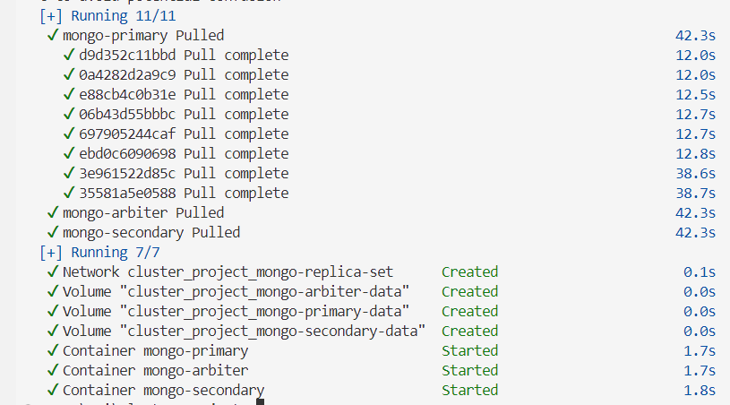
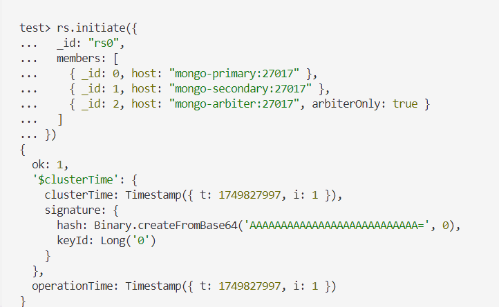
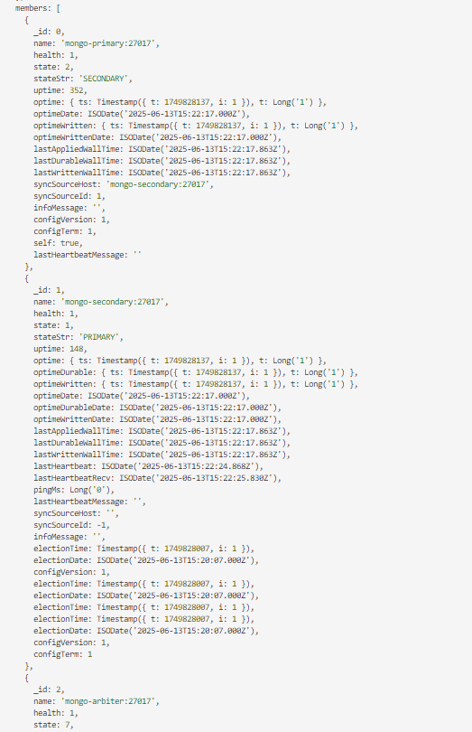
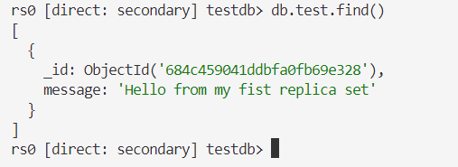

# MongoDB Replica Set with Docker Compose

This project provides a simple and easy-to-use MongoDB replica set setup using Docker Compose. It includes two data-bearing nodes and an optional arbiter for voting.

---

## 1. Start the Cluster

Run the following command in your project directory:
```bash
docker-compose up -d
```
This will start three containers: `mongo-primary`, `mongo-secondary`, and `mongo-arbiter`.


*All containers are up and running.*

## 2. Initialize the Replica Set

Connect to the primary node:
```bash
docker exec -it mongo-primary mongosh
```

In the MongoDB shell, run:
```javascript
rs.initiate({
  _id: "rs0",
  members: [
    { _id: 0, host: "mongo-primary:27017" },
    { _id: 1, host: "mongo-secondary:27017" },
    { _id: 2, host: "mongo-arbiter:27017", arbiterOnly: true }
  ]
})
```
Wait a few seconds for the replica set to initialize.



*Replica set successfully initiated.*

## 3. Check Replica Set Status

In the same shell, check the status:
```javascript
rs.status()
```
You should see:
- PRIMARY: mongo-primary
- SECONDARY: mongo-secondary
- ARBITER: mongo-arbiter



*Replica set status showing PRIMARY, SECONDARY, and ARBITER.*

## 4. Test Replication

Insert a test document in the primary:
```javascript
use testdb
db.test.insertOne({ message: "Hello Replica Set!" })
```

Now connect to the secondary node:
```bash
docker exec -it mongo-secondary mongosh
```
In the shell, run:
```javascript
use testdb
db.test.find()
```
You should see the document you inserted from the primary.



*Test document successfully read from SECONDARY.*

## 5. (Optional) Add an Admin User and Enable Authorization

If you want to enable authentication, follow the official MongoDB documentation for replica sets with authorization. This simple setup does not include authentication for easier testing.

## 6. What to Submit

- `docker-compose.yml`
- The commands you used for initialization and validation
- Screenshots or logs showing:
  - Successful replica set initialization
  - Correct node roles (PRIMARY/SECONDARY/ARBITER)
  - Successful replication of a test document

## Tips
- If you want to test failover, stop the primary with `docker stop mongo-primary` and check which node becomes PRIMARY.
- To clean up everything, run `docker-compose down -v`.

This setup is intended for learning and testing. For production, always enable authentication and follow MongoDB security best practices. 